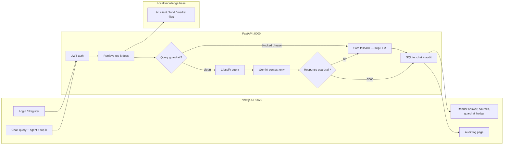

# FinAdvisor Copilot

Compliance-aware advisor copilot: **retrieve → guard → route → generate → guard → audit**.

Built as an end-to-end demo for advisor workflows — not a generic finance chatbot. Answers must stay grounded in a local knowledge base, avoid direct product recommendations, and leave a trace of what happened.

---

## Problem

Advisors ask questions across **client profiles**, **portfolio / allocation language**, and **market or fund notes**. A raw LLM will invent numbers and phrase advice as “you should buy…”. In a regulated-style setting that is a product failure, not a UX nit.

This app treats that as a pipeline problem:

1. Only answer from retrieved documents.
2. Block recommendation-style language on the **query** and on the **model output**.
3. Show sources in the UI.
4. Persist query, agent, guardrail flag, and response per user.

Knowledge base content is **synthetic demo data** (not real client PII).

---

## What shipped

- **Auth:** register / login, bcrypt passwords, JWT on protected chat and logs routes.
- **RAG:** load `backend/data/knowledge_base/*.txt`, score documents against the query, return top-k with source names.
- **Agents:** `portfolio`, `client_research`, `market_context`, plus `auto` keyword routing (client names and suitability phrases win over generic words like “risk”).
- **Guardrails:** case-insensitive phrase checks before generation (skip the LLM) and after generation (replace unsafe text).
- **LLM:** Gemini with a strict “context-only” system prompt; model-id fallbacks; grounded extract if the API key or model is unavailable.
- **Audit:** SQLite `chat_messages` (per-user history + logs UI) and `audit_logs` (includes retrieved-doc JSON).
- **UI:** Next.js chat (agent picker, top-k, sources, guardrail badge) and an audit log page. Legacy Express UI in `frontend-node/`.

---

## Tech stack

| Layer | Choice | Why |
| --- | --- | --- |
| API | Python, FastAPI, Pydantic | Typed request validation, OpenAPI, clean routers/services split |
| DB | SQLAlchemy + SQLite (Postgres URL already supported) | Zero-ops local demo; `DATABASE_URL` can point at Postgres |
| Auth | JWT (`python-jose`) + bcrypt | Stateless API for a separate frontend origin |
| Retrieval | Lexical scoring over whole KB files | Small, name-heavy corpus; scores are inspectable; no extra embedding runtime |
| Generation | Gemini (`google-generativeai`, default `gemini-2.5-flash`) | Fast/cheap grounded summarization |
| Frontend | Next.js 16, React 19, TypeScript, `react-markdown` | Product-shaped chat + logs, not a notebook |
| Deploy notes | `vercel.json` backend prefix `/api/backend`, Railway Dockerfile | Frontend/API split; `root_path` when `VERCEL` is set |

---

## How a request runs (`POST /chat`)



**Why each piece**

| Piece | Role | Why this, not that |
| --- | --- | --- |
| Next.js | Login, chat, sources, logs | Advisors need a clickable product, not a notebook |
| JWT | Protect `/chat` and `/logs` | API and UI can live on different origins (local or Vercel) |
| Lexical retrieve | Pick the right `.txt` files | Tiny, name-heavy corpus; inspectable scores; no embedding runtime |
| Query guardrail | Block “you should buy…” before generation | Don’t pay for or generate banned advice |
| Agent label | `portfolio` / `client_research` / `market_context` | Matches how advisors think; stored on the audit row |
| Gemini | Summarize **only** retrieved context | Fast/cheap; fallbacks if the model ID or key fails |
| Response guardrail | Scan the completion | Models still emit recommendation language |
| SQLite | Chat history + audit JSON | Zero-ops demo; Postgres URL already supported |

```text
JWT user
  → retrieve top-k docs (keyword overlap + named-client boost)
  → guardrail on QUERY
        hit  → safe fallback, agent_used = guardrail_blocked, no LLM
        miss → classify agent (auto) or use explicit agent
             → Gemini (context-only prompt)
             → guardrail on RESPONSE (replace if hit)
  → write AuditLog + ChatMessage
  → return { response, agent_used, guardrail_triggered, retrieved_docs }
```

**Retrieval (what actually runs):** tokenize the query, drop stopwords, score each `.txt` file by term hits. If the query names a known person (first **and** last name: Alice Chen, Bob Martinez, Sarah Johnson), boost that profile and penalize other people. Keep docs scoring at least 50% of the best match, then take top-k (default 3, UI range 1–10).

This is **not** a FAISS / embedding index. Embeddings are a natural next step when the corpus grows; lexical search is the right default for this closed, entity-specific set.

**Routing:** keyword classifier. Order is intentional: client-research first, then portfolio, then market, else portfolio. The agent label is stored and shown in the UI. Retrieval is still over the full KB (domain-filtered retrieve is a clear follow-up).

**Generation prompt (intent):** answer only from provided context; do not invent data; do not inline citations (the UI shows sources); stay on the named person; if context is thin, say so.

---

## Guardrail phrases

Case-insensitive substrings:

- `you should buy`
- `i recommend purchasing`
- `sell your`
- `guaranteed return`
- `will definitely`
- `sure to profit`

Fallback: no direct recommendation; retrieved sources still returned for the advisor to read.

---

## Knowledge base

| File | Typical questions |
| --- | --- |
| `client_profile_alice_chen.txt` | Moderate risk, ~60/30/10, ~20-year retirement horizon |
| `client_profile_bob_martinez.txt` | Moderate-conservative, income / drawdown, 6–8 years to retirement |
| `client_profile_sarah_johnson.txt` | Aggressive / growth, high equity sleeve |
| `fund_factsheet_global_equity.txt` | AUM, expense ratio, returns (demo figures) |
| `market_summary_q1_2026.txt` | Q1 2026 highlights and risks |
| `market_outlook_rates_credit_q1_2026.txt` | Rates, credit, liquidity |
| `regional_equity_performance_q1_2026.txt` | Regional equity drivers |

Restart is not required for retrieval (docs load on first retrieve). Edit a file and send a new query.

---

## Try these in the UI

Safe / grounded:

- What is Alice Chen's risk tolerance?
- Summarise Bob Martinez's investment goals
- What were Q1 2026 market highlights?
- Show me the global equity fund AUM

Guardrail (should block generation):

- You should buy the global equity fund

Then open **Audit log** and confirm agent + guardrail status.

---

## Repository structure

```text
.
├── backend/
│   ├── app/
│   │   ├── core/            # settings, JWT / password helpers
│   │   ├── db/              # SQLAlchemy engine / session
│   │   ├── deps/            # get_current_user
│   │   ├── models/          # User, ChatMessage, AuditLog
│   │   ├── routers/         # auth, chat, logs, health
│   │   └── services/        # RAG, guardrail, router, Gemini
│   ├── data/knowledge_base/ # source .txt docs
│   ├── requirements.txt
│   └── Dockerfile
├── frontend/                # Next.js (port 3020)
├── frontend-node/           # Express UI (port 3010)
├── vercel.json              # frontend + backend services, /api/backend prefix
└── railway.toml             # backend image, /health check
```

---

## Environment

Create `backend/.env`:

```env
APP_NAME=FinAdvisor Copilot API
DATABASE_URL=sqlite:///./finadvisor.db
JWT_SECRET_KEY=replace-with-a-long-random-secret
JWT_ALGORITHM=HS256
ACCESS_TOKEN_EXPIRE_MINUTES=60
GEMINI_API_KEY=your_google_gemini_key
GEMINI_MODEL=gemini-2.5-flash
```

Frontend: `NEXT_PUBLIC_API_BASE_URL` (defaults to `http://127.0.0.1:8000`).

Optional: `FINADVISOR_FAST_DEMO=1` skips Gemini and returns short grounded stubs (demo only).

---

## Local setup

### 1) Backend

```bash
cd backend
python3 -m venv venv
source venv/bin/activate   # Windows: venv\Scripts\activate
pip install -r requirements.txt
uvicorn app.main:app --reload --port 8000
```

API: `http://localhost:8000`

### 2) Frontend (recommended)

```bash
cd frontend
npm install
npm run dev
```

UI: `http://localhost:3020`

### 3) Alternate frontend

```bash
cd frontend-node
npm install
npm start
```

UI: `http://localhost:3010`

---

## API

| Method | Path | Auth |
| --- | --- | --- |
| `GET` | `/health` | no |
| `POST` | `/auth/register` | no |
| `POST` | `/auth/login` | no |
| `GET` | `/chat/status` | no |
| `GET` | `/chat/history` | yes |
| `POST` | `/chat/retrieve` | no |
| `POST` | `/chat/guardrail-check` | no |
| `POST` | `/chat/agent-run` | no |
| `POST` | `/chat` | yes |
| `GET` | `/logs/status` | yes |
| `GET` | `/logs` | yes |

On Vercel, the API is mounted under `/api/backend` (`root_path` when `VERCEL` is set).

---

## Conclusion

FinAdvisor Copilot is a working demonstration of a **constrained LLM application**: retrieval, routing, generation, policy checks, and audit logging in one path, with a UI an advisor can actually use.

The design priority is **trustworthiness over unconstrained fluency**. Answers are limited to retrieved context, recommendation-style language is blocked on both the inbound query and the model output, and every turn is persisted with the agent used and whether a guardrail fired. Retrieval is lexical and inspectable on a small, name-sensitive corpus; vector search remains a natural extension if the knowledge base grows.

This is a **demo environment** with synthetic client and market documents — not live market data, not production investment advice, and not a substitute for a human advisor. The codebase is structured so the next increments are clear: domain-filtered retrieval, embedding-based ranking with a measured comparison to the current scorer, stronger policy coverage, and richer operational metrics (latency, cost, error rates).

The result is a full-stack reference for how an advisor copilot can be specified, implemented, and explained end to end.
