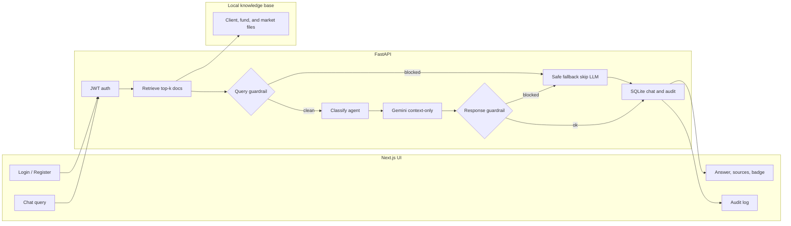

# FinAdvisor Copilot

**A compliance-aware advisor copilot — not another finance chatbot.**

> Retrieve → Guard → Route → Generate → Guard → Audit

Unconstrained LLMs invent numbers and say *“you should buy.”* In an advisor workflow, that is not a cute answer. It is a **trust failure**.

FinAdvisor Copilot is an end-to-end demo of **Augmented Intelligence**: grounded retrieval, dual policy checks, specialist routing, and a full audit trail — behind a UI an advisor can actually click.

**Synthetic demo data only.** Not real client PII. Not live market data. Not production investment advice.

<p align="center">
  
  
  
  
  
</p>

---

## Why this exists

| What breaks with a raw LLM | What FinAdvisor enforces |
| --- | --- |
| Invented AUM, risk, or returns | Answers only from retrieved `.txt` notes |
| “You should buy…” / guaranteed returns | Guardrail on the **question** and the **completion** |
| No proof of what happened | JWT user + SQLite audit of query, agent, sources, flag |
| Black-box chat | Sources, agent badge, and guardrail status in the UI |

---

## Architecture

Three layers. One `POST /chat`.




1. **Login / Register** — get a JWT. **Chat query** — send question + agent + top-k.
2. **JWT auth** — no valid token, stop.
3. **Retrieve top-k** from the **knowledge base** (client / fund / market `.txt` files).
4. **Query guardrail** — if the question has a blocked phrase (“you should buy”) → **safe fallback, skip Gemini**. If **clean** → keep going.
5. **Classify agent** — stamp client / portfolio / market (label, not three models).
6. **Gemini context-only** — answer only from retrieved files.
7. **Response guardrail** — if the answer is banned language → **safe fallback**. If **ok** → keep it.
8. **SQLite** — every path is saved (blocked or not).
9. **Answer, sources, badge** in chat. **Audit log** is the same turn as a paper trail.

Start at **Chat**. End at **Audit log**. Middle is retrieve → maybe block → maybe Gemini → always save.

---

## What shipped

| Capability | How it works |
| --- | --- |
| **Auth** | bcrypt passwords · JWT on chat and logs |
| **Retrieval** | Lexical scoring over whole KB files · named-client boost (Alice / Bob / Sarah) · top-k |
| **Agents** | `portfolio` · `client_research` · `market_context` · auto (client names win over generic “risk”) |
| **Policy** | Phrase list before generation (skip LLM) and after (replace unsafe text) |
| **Generation** | Gemini, **context-only** · fallbacks if the model ID fails · file extract if no API key |
| **Traceability** | Chat history + audit JSON of retrieved docs |
| **UI** | Next.js · agent picker · sources · guardrail badge · audit page |

Retrieval is **not** FAISS. The corpus is small and name-heavy — inspectable keyword search is the right default. Embeddings are the next measured experiment, not a resume keyword.

---

## 60-second demo

1. Register / login.
2. **“What is Alice Chen's risk tolerance?”** → client research · sources = her profile · moderate risk, not invented.
3. **“You should buy the global equity fund.”** → guardrail · Gemini skipped · safe fallback.
4. Open **Audit log** → same turns, agent + triggered vs clear.

Also try: *What were Q1 2026 market highlights?*

---

## Run locally

**API** — `http://localhost:8000`

```bash
cd backend
python -m venv venv
venv\Scripts\activate
pip install -r requirements.txt
uvicorn app.main:app --reload --port 8000
```

**UI** — `http://localhost:3020`

```bash
cd frontend
npm install
npm run dev
```

`backend/.env`:

```env
GEMINI_API_KEY=your_key
JWT_SECRET_KEY=replace-with-a-long-random-secret
DATABASE_URL=sqlite:///./finadvisor.db
```

---

## Design stance

Trustworthiness over unconstrained fluency. The human advisor still owns the recommendation. The copilot briefs from files, refuses sales language, and leaves a paper trail.

**Next:** domain-filtered retrieve · gold-set evals (hit@k, guardrail precision/recall, latency, cost) · embedding A/B vs this scorer.
