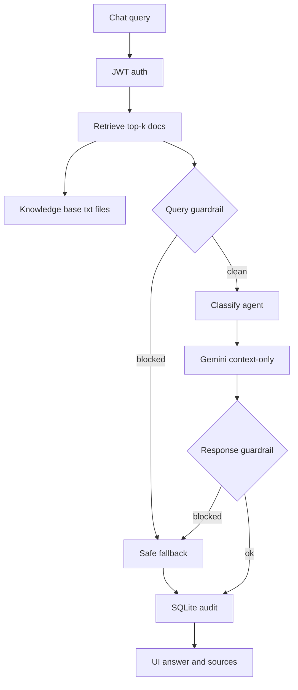

# FinAdvisor Copilot

Compliance-aware advisor copilot: **retrieve → guard → route → generate → guard → audit**.

Built for advisor workflows — not a generic finance chatbot. Answers stay grounded in a local knowledge base, avoid direct product recommendations, and leave an audit trail.

---

## Problem

Advisors ask about **client profiles**, **portfolio / allocation**, and **market or fund notes**. A raw LLM invents numbers and says “you should buy…”. In a regulated-style setting that is a product failure.

Success means:

1. Answer only from retrieved documents.
2. Block recommendation language on the **query** and **model output**.
3. Show sources in the UI.
4. Persist query, agent, guardrail flag, and response per user.

Knowledge base content is **synthetic demo data** (not real client PII).

---

## What shipped

- **Auth** — register / login, bcrypt, JWT on chat and logs
- **RAG** — lexical scoring over `backend/data/knowledge_base/*.txt`, top-k with source names
- **Agents** — `portfolio`, `client_research`, `market_context`, plus auto keyword routing
- **Guardrails** — phrase checks before generation (skip LLM) and after (replace unsafe text)
- **LLM** — Gemini, context-only prompt; grounded fallback if API key missing
- **Audit** — SQLite chat history + audit log (includes retrieved-doc JSON)
- **UI** — Next.js chat (agent picker, sources, guardrail badge) and audit log page

**Stack:** FastAPI · Next.js · SQLite · Gemini · deployed on Vercel

---

## How a request runs



**In plain terms:** authenticate → search local files → block bad questions → label agent → Gemini on retrieved context only → scan answer → save → show UI with sources.

Retrieval uses keyword overlap plus a boost when the query names Alice Chen, Bob Martinez, or Sarah Johnson (first and last name). Not FAISS — corpus is small and name-heavy.

---

## Try in the UI

**Grounded:**

- What is Alice Chen's risk tolerance?
- What were Q1 2026 market highlights?

**Guardrail (blocks generation):**

- You should buy the global equity fund

Then check **Audit log**.

---

## Local setup

**Backend** (`http://localhost:8000`)

```bash
cd backend
python -m venv venv
venv\Scripts\activate          # Windows
pip install -r requirements.txt
uvicorn app.main:app --reload --port 8000
```

**Frontend** (`http://localhost:3020`)

```bash
cd frontend
npm install
npm run dev
```

Create `backend/.env`:

```env
GEMINI_API_KEY=your_key
JWT_SECRET_KEY=replace-with-a-long-random-secret
DATABASE_URL=sqlite:///./finadvisor.db
```

---

## Conclusion

FinAdvisor is a **constrained LLM demo**: retrieval, routing, generation, dual guardrails, and audit logging in one pipeline with a usable UI. Synthetic data only — not live market data or production investment advice.

Priority is **trustworthiness over fluency**: grounded context, blocked recommendation language, and a log of every turn.
